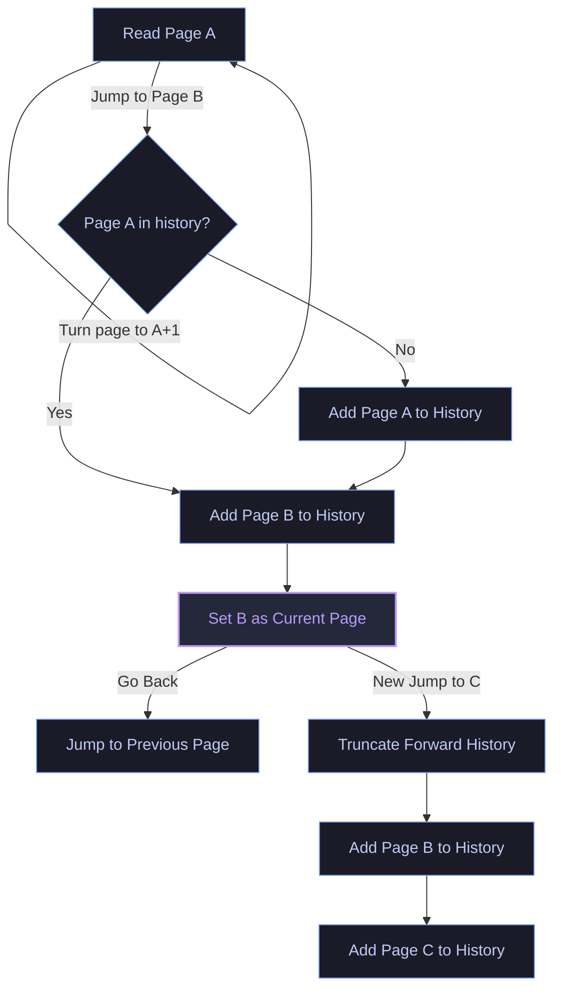

<div align="center">

# 🧭 Kojump

### *Browser-style back & forward page navigation history for KOReader*

[](https://koreader.rocks/)
[](https://www.lua.org/)
[](LICENSE)
[](#)

---

**Kojump** brings modern web-browser-style navigation to [KOReader](https://github.com/koreader/koreader). 
Never lose your place again when jumping to footnotes, chapters, indexes, or custom locations. With Kojump, you can seamlessly navigate back and forward through your reading history, view a visual map of your jumps, and resume reading instantly.

[Key Features](#-features) • [How It Works](#-how-it-works) • [Installation](#%EF%B8%8F-installation) • [Usage](#-usage) • [Development](#%EF%B8%8F-development--testing) • [Contributing](#-contributing)

</div>

---

## 🌟 Features

*   **🧭 Browser-Style Navigation:** Seamlessly jump `Back` and `Forward` through your reading history.
*   **📊 Smart Jump Detection:** Automatically tracks page changes with a step size of $> 1$ page (e.g., table of contents jumps, footnote clicks, search jumps), while ignoring normal consecutive page turns.
*   **📜 Rich History Menu:** Shows a clean, interactive chronological list of your navigation history, complete with:
    *   Directional arrows (`←`, `→`, and `•` for the current page).
    *   Chapter/TOC titles (automatically retrieved and safely truncated to 40 characters).
    *   Reading percentages (e.g., `(15%)`).
*   **💾 Per-Document Persistence:** History is saved automatically inside KOReader's document settings, so your navigation history persists across reader restarts.
*   **⚡ Keybindings & Dispatcher Integration:** Full support for KOReader's action dispatcher, allowing you to bind back, forward, and history commands to swipes, taps, keys, or gestures.
*   **🛡️ Fully Unit Tested:** Contains a comprehensive Busted test suite verifying navigation edge cases, history branching, capacity bounds, and settings persistence.

---

## ⚙️ How It Works

Kojump tracks page jumps and manages history using a standard browser-style stack representation.



*   **Consecutive Page Turns:** Ignored to keep the history clean.
*   **Forward History Branching:** If you are at a previous page in your history and perform a new jump, any forward history is pruned, and a new branch is created (identical to how web browsers handle history).
*   **Capacity Limit:** Kojump maintains a sliding window of the last 20 jumps, preventing document settings from bloating.

---

## 🛠️ Installation

### 1. Locate KOReader Plugin Directory
Depending on your device, the KOReader `plugins` directory is located at:
*   **Android:** `/sdcard/koreader/plugins/`
*   **Kobo / Kindle:** `/mnt/onboard/.koreader/plugins/` (or wherever your `.koreader` folder is mapped)
*   **Linux / macOS (Emulator):** `~/.config/koreader/plugins/`

### 2. Copy the Plugin
Clone or copy this repository into the plugins directory under the name `kojump.koplugin`:

```bash
# Clone directly into your KOReader plugins directory
git clone https://github.com/yourusername/kojump.koplugin.git kojump.koplugin
```

Ensure your directory structure looks like this:
```text
kojump.koplugin/
├── _meta.lua
├── main.lua
├── README.md
└── spec/
    └── kojump_spec.lua
```

### 3. Restart KOReader
Restart KOReader to load the new plugin.

---

## 📖 Usage

### Action Dispatcher & Shortcuts
For the best experience, map the Kojump actions to gestures, keys, or multiswipes:
1. Go to **Settings (Gear icon) > Device > Key bindings** (or Gestures / Taps depending on your device).
2. Choose a gesture (e.g., Swipe Left from Edge, Double Tap).
3. Select from the Kojump actions:
    *   **`Kojump: Go Back`** (`kojump_back` / `KojumpBack`)
    *   **`Kojump: Go Forward`** (`kojump_forward` / `KojumpForward`)
    *   **`Kojump: Show History`** (`kojump_show_history` / `KojumpShowHistory`)

### Main Menu Access
Kojump also integrates directly into the KOReader menu:
*   Open the main menu.
*   Navigate to the **Navigation** tab (indicated by the compass/navigation icon).
*   Use the **Kojump: Go Back**, **Kojump: Go Forward**, or **Kojump: Show History** options.

---

## 🧪 Development & Testing

### Prerequisites
To run unit tests, install **Lua** (5.1 or LuaJIT) and **Busted**:
```bash
luarocks install busted
```

### Running Tests
Execute the Busted suite from the plugin root directory:
```bash
busted spec/kojump_spec.lua
```

---

## 🤝 Contributing

Contributions are welcome! If you would like to help improve Kojump:
1. **Fork** the repository.
2. Create a **feature branch** (`git checkout -b feature/amazing-feature`).
3. Write clean, documented Lua code and add corresponding unit tests in the `spec/` directory for any new logic.
4. Run the test suite (`busted spec/kojump_spec.lua`) to verify all tests pass.
5. Commit your changes using [Conventional Commits](https://www.conventionalcommits.org/).
6. Open a **Pull Request** detailing your changes.

---

## 📄 License

This project is licensed under the [MIT License](LICENSE) - see the [LICENSE](LICENSE) file for details.
